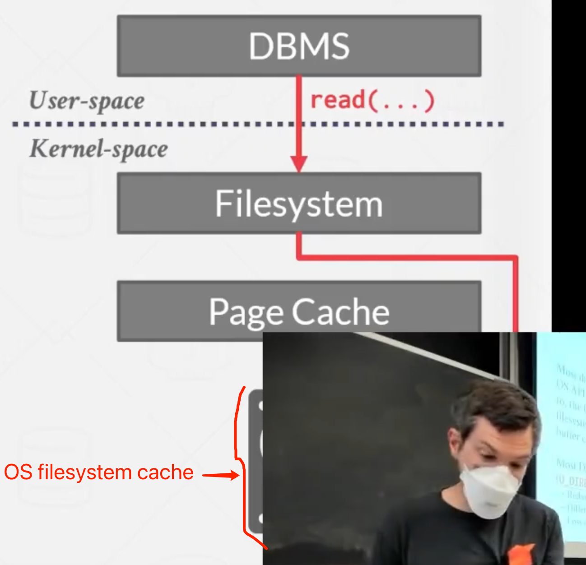

# Memory Management and Buffer Cache

### OS Page Cache

Most disk operations go through the OS API. Unless the DBMS tells it not to, the OS maintains
its own filesystem cache (a.k.a page cache, buffer cache, etc.).

Most DBMSs use direct I/O (O_DIRECT) to bypass the OS cache.

- Redundant copies of pages.
- Different eviction policies.
- Loss of control over file I/O.

### Buffer Replcement Policies

When the DBMS needs to free up a frame to make room for a new page, it must decide which page to **evict** from the buffer pool.

Goals:

- Correctness
- Accuracy
- Speed
- Meta-data overhead

