# Memory Management and Buffer Cache

### OS Page Cache

Most disk operations go through the OS API. Unless the DBMS tells it not to, the OS maintains
its own filesystem cache (a.k.a page cache, buffer cache, etc.).

Most DBMSs use direct I/O (O_DIRECT) to bypass the OS cache.

- Redundant copies of pages.
- Different eviction policies.
- Loss of control over file I/O.

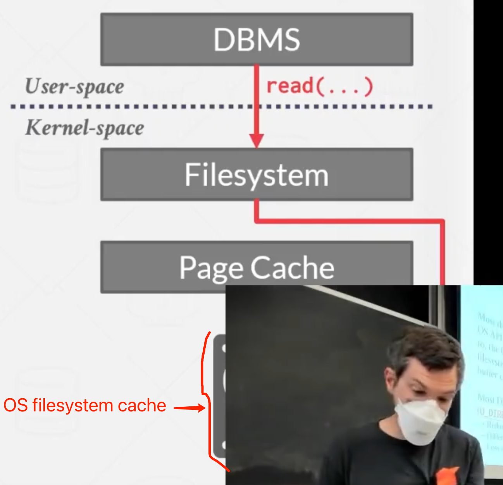


### Buffer Replcement Policies

When the DBMS needs to free up a frame to make room for a new page, it must decide which page to **evict** from the buffer pool.

Goals:

- Correctness
- Accuracy
- Speed
- Meta-data overhead


### Least-Recently Used (LRU)

Maintain a single timestamp of when each page was last accessed.

When the DBMS needs to evict a page, select the one with the oldest timestamp.

- Keep the pages in sorted order to reduce the search time on eviction. 


### Clock

This is an approximation of LRU that does not need a separate timestamp per page.

- Each page has a reference bit.
- When a page is accessed, set the bit to 1.

Organize the pages in a circular buffer with a "clock hand":

- Upon sweeping, check if a page's bit is set to 1.
- If yes, set to zero. If no, then evict.


More specifically, it can be explained as the following images:

Firstly (Initially), we can see that there are 4 pages in the buffer pool, every page has its reference bit set to 0. Currently, there is no clock hand.

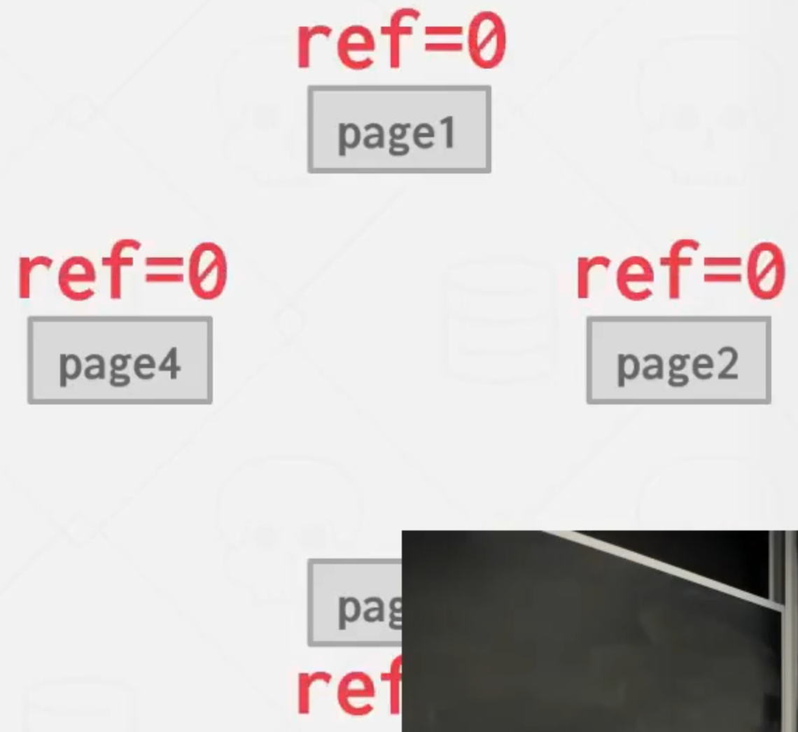


Then, when a query accesses the page-1, we flip the reference bit of this page to one, and 
we have the clock hand (the Big red up-toward arrow in the image).

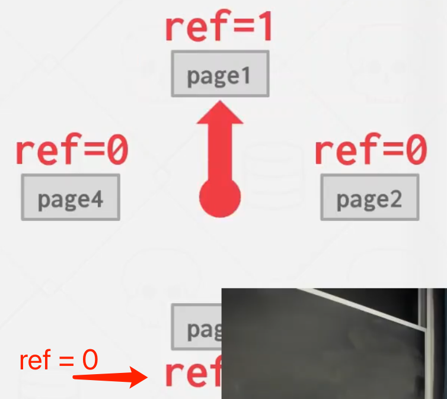

Next, the clock hand is sweeping around continuously. Anytime it looks at a page if the reference bit of the page is set to one, it sets it to zero, otherwise if it is already set to zero, then it knows that this page has not been accessed since last time the clock hand swept around, so,
therefore, this page could be evicted.

As currently, the clock hand points to page-1, and because its reference bit is now setting to 1, then we set it to zero, the page-1 does need to be evicted now.

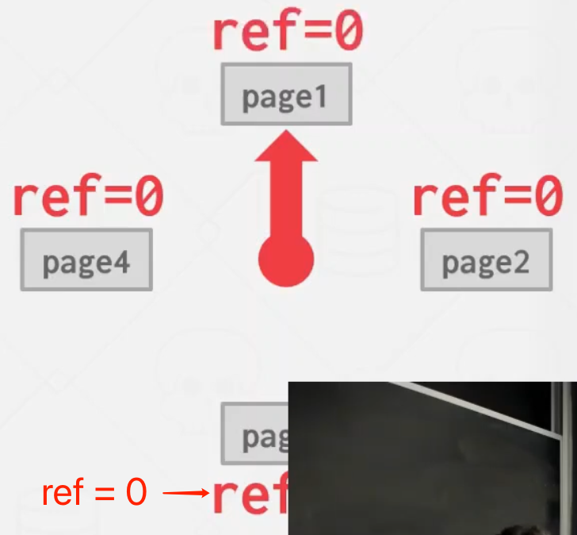


Then sweep to the next page, which is page2.

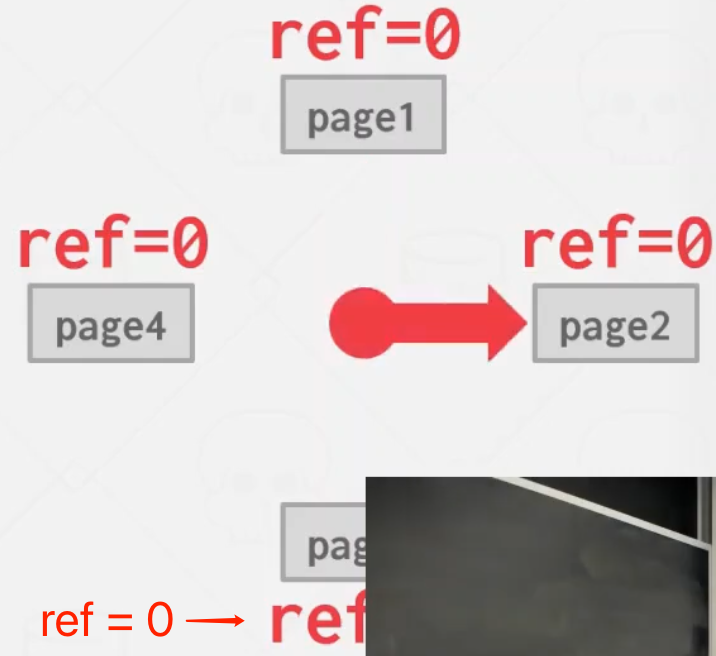

Because page-2 reference bit is now set to zero, so the buffer knows that we can evict this page, because we have not accessed this page-2 since the last time the clock hand came around.

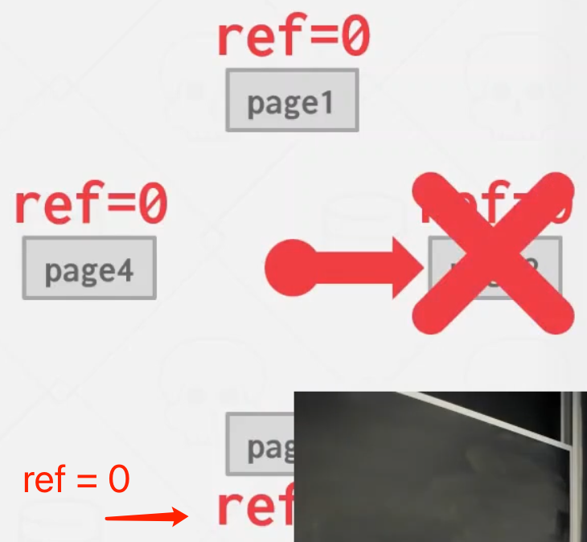

After evict the page-2, we fill a new page-5 in the circular buffer and set its reference bit to zero.

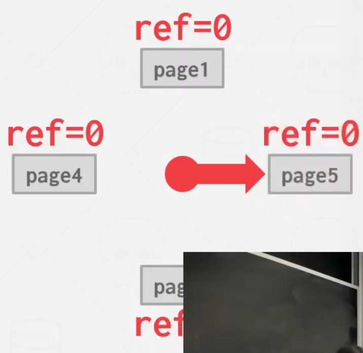

According to the above steps, we know that instead of maintain the exact order in the pages that we accessed as they would in LRU, we 
just use clock machanism as an approximation of LRU to decide which pages is safe to be ecicted.

The Clock is used in a bunch of different fields outside of database systems, such as Linux uses a multi-hand version of clock for their page eviction algorithms, in a word, this clock technique is very common.


### Problems

LRU and Clock replacement policies are susceptible to **sequential flooding**.

- A query performs a sequential scan that read every page.
- This pollutes the buffer pool with pages that are read once and then never again.

In some workloads the most recently used page is the most unneeded page.

#### Sequential Flooding

Suppose we have query like this:

```sql
SELECT * FROM A WHERE id = 1 
```

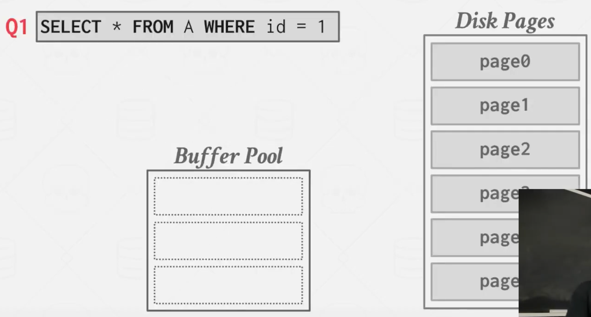

And say that we have an index, the we go get that single record that we want, or the single page that we need.

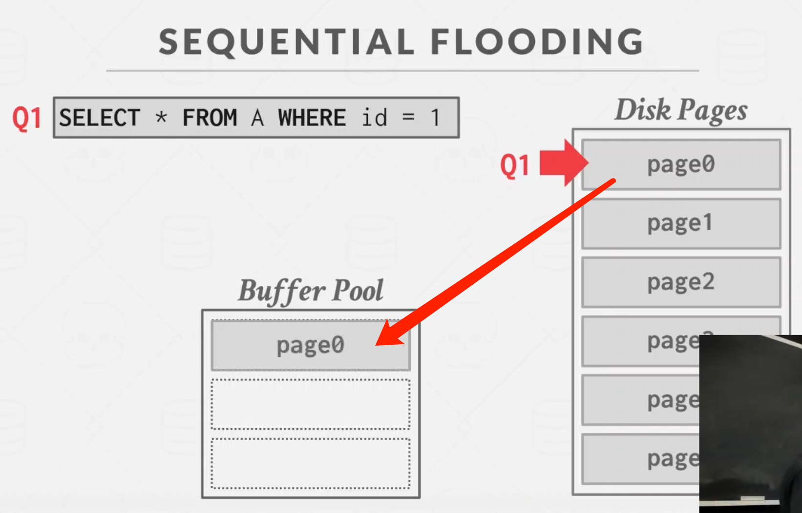

Now we have another sequential query scan (Q2):
```sql
SELECT AVG(val) FROM a
```

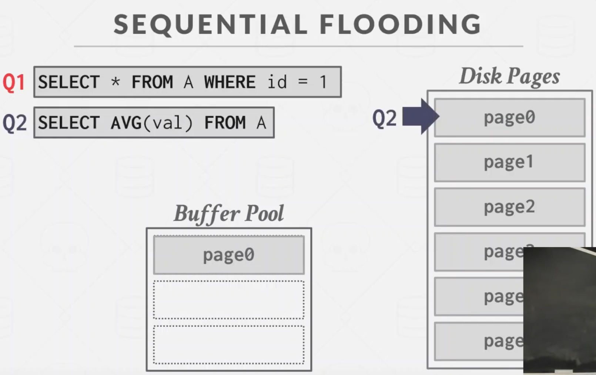

The Q2 is getting scanning along and flooding our buffer pool with a bunch of pages (page-0, page-1 and page-2).


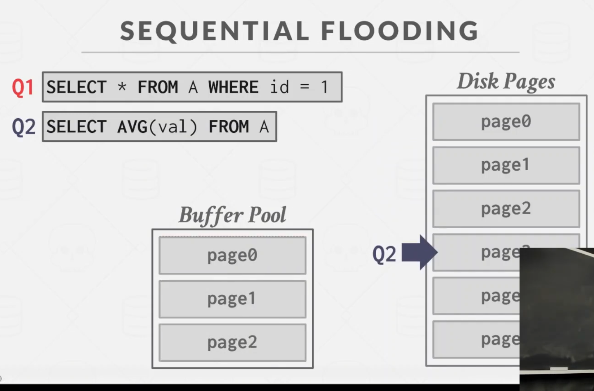


Now, at this point, we need to evict page-0 because we need free space to pick page-3 into buffer pool.

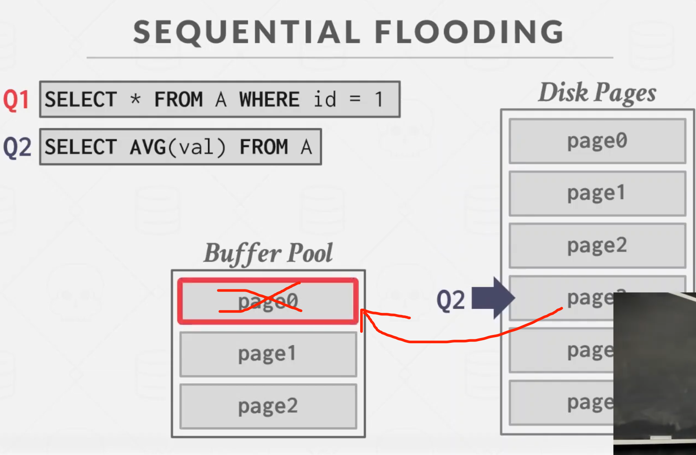

After eviction, now page-0 is evicted and page-3 is now in the buffer pool.

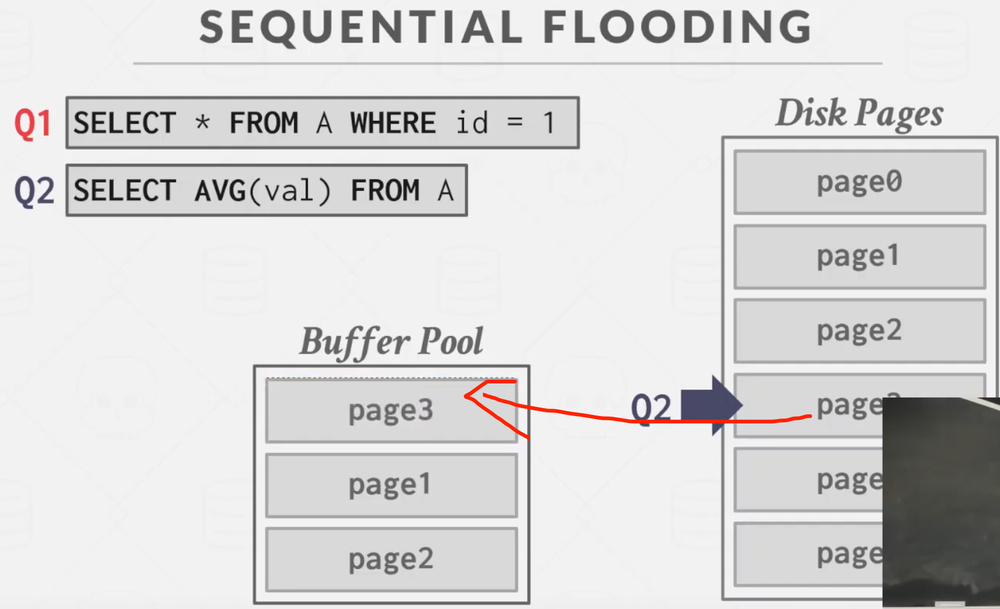

Now, the same query (Q3) shows up again that needs page-0.
Because page-0 is evicted, so we need to find which page needs to be evicted now. According to least recently used, the page-1 will be ecvited so that we can put the page-0 used for Q3 into buffer pool.

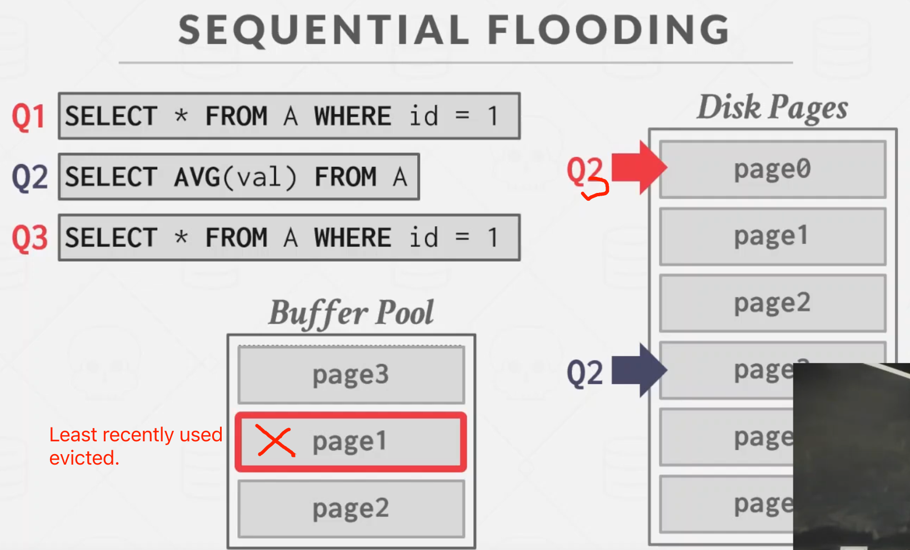


### Better Policies: LRU-K

Track the history of last K references to each page as timestamps and compute the interval between subsequent accesses.

The DBMS then uses this history to estimate the next time that page is going to be accessed.

The LRU-K is one of the tasks in the lab project-1.

### Better Policies: Localization

(This policy is skipped in the video cource.)

The DBMS chooses which pages to evict on a per query basis.
This minimizes the pollution of the buffer pool from each query.
- Keep track of the pages that a query has accessed.

Example: Postgres maintains a small ring buffer that is private to the query.

### Better Poclies: Priority Hints

The DBMS knowns about the context of each page during query execution.

It can provide hints to the buffer pool on whether a page is import or not.

Given a simple example is that we have a bunch of insert queries table. The Query (Q1) is like below, the query is inserting some primary key value that is incrementing by one each time.

```sql
INSERT INTO A VALUES (id++)
```

So, we are always going to insert new data on the right side of the tree, so therefore maybe I want the database system to keep these pages in memory rather than other ones, because for the next insert will go on that side.

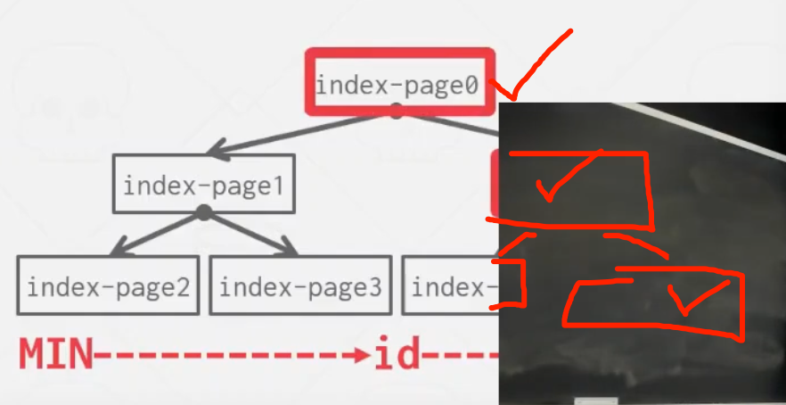


### Dirty Pages

**Fast Path**: If a page in the buffer pool is **not** dirty, then the DBMS can simply "drop" it.

**Slow Path**: If a page is dirty, then the DBMS must write back to disk to ensure that its changes are persisted.

Trade-off between fast evictions versus dirty writing pages that will not be read again in the future.


### Background Writing

The DBMS can periodically walk through the page table and write dirty pages to disk.

When a dirty page is safely written, the DBMS can either evict the page or just unset the dirty flag.

Need to be careful that the system doesn't write dirty pages before their log records are written.


### Other Memory Pools

The DBMS needs memory for thins other than ust tuples and indexes.

These other memory pools may not always backed by disk. Depends on implementation.
- Sorting + Join Buffers
- Query Caches
- Maintenance Buffers
- Log Buffers
- Dictionary Caches


# Conclusion

The DBMS can almost always manage memory better than the OS.

Leverage the semantics about the query plan to make better decisions:
- Evictions
- Allocations
- Pre-fetching


# Next Class

Has Tables

# Project 1

You will build the first component of your storage manager.
- Extendible Hash Table
- LRU Replacement Policy
- Buffer Pool Manager Instance

We will provide you with the disk manager and page layouts.

## Task 1 - Extendible Hash Table

Build a thread-safe extendible hash table to manage the DBMS's buffer pool page table that is mapping from the page IDs to the buffer frames.
- Use unordered buckets to store key/value pairs.
- You must support growing table size.
- You do **NOT** need to support shrinking.

General Hints:
- You can use std::hash and std::mutex.

In the course the professor said the above std::mutex and std::hash (or only std::mutex, I am not sure) maybe out of date, so ask us to use the rewritten-latch implementation provided by the lab to do protections.

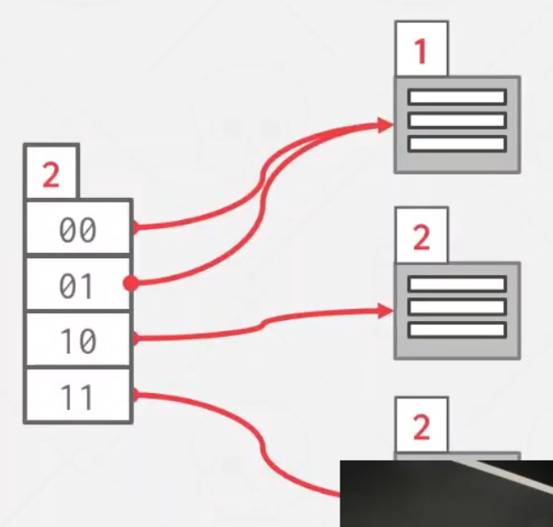


## Task 2 - LRU-K Replcement Policy

Build a data structure taht tracks the usage of pages. using the **LRU-K** policy.

General Hints:
- Your **LRUKReplacer** needs to check the "pinned" status of a **Page**.
- If there are no pages touched since last sweep, then return the lowest page id.

## Task3 - Buffer Pool Manager

Use your LRU-K Replacer to manage the allocation of pages.
- Need to maintain internal data structures to track allocated + free pages.
- We will provide you components to read/write data from disk.
- Use whatever data structure you want for the page table.

General Hints:
- Make sure you get the order of operations correct when pinning.

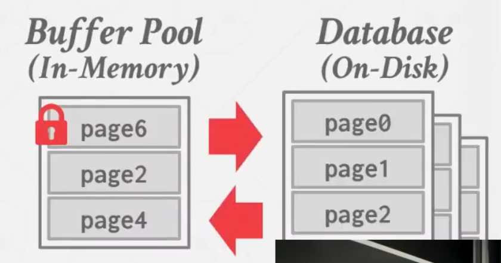

## Things to Note

Do **NOT** change any file other than the six that you must hand in. Other changes will not be graded.

The projects are cumulative.

We will **NOT** be provding silutions.

Post any questions on Piazza or come to office hours, but we will **NOT** help you debug.


## Code Quality

We will automatically check whether you are writing good code.
- Google C++ Style Guide:
  - [En](https://google.github.io/styleguide/cppguide.html)
  - [Cn](http://zh-google-styleguide.readthedocs.org/en/latest/)
- Doxygen Javadoc Style

You need to run these targets before you submit your implementation to Gradescope.
- make format
- make check-lint
- make check-clang-tidy-p1

## Extra Credit

Gradescope Leaderboard runs your code with a specialized in-memory version of BusTub.

The top 20 fastest implementations in the class will receive extra credit for this assignment.
- No.1: 50% bonus points
- No.2-10: 25% bonus points
- No.11-20: 10% bonus points

Student with the most bonus points at the end of the semster will receive a BusTub shirt!

## Plagiarism Warning

The homework and projects must be your own original work. They are **NOT** group assignments.

You may **NOT** copy source code from other people or the web.

Plagiarism is **NOT** tolerated. You will get lit up.
- Please ask me if you are unsure.

See CMU's Policy on Academic Integrity for additional information.
